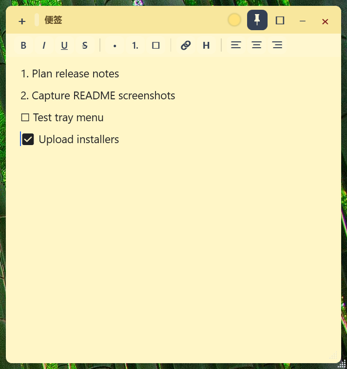
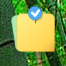

# DeskStickyNotes

DeskStickyNotes is a lightweight, open-source, Win7-style sticky notes app for Windows 10/11.

It is built for people who want notes to stay visible while they work: desktop-first sticky notes, per-note always-on-top, a compact draggable icon mode, tray management, local storage, and a clean native WPF interface.

中文文档: [README.zh-CN.md](README.zh-CN.md)

## AI-Assisted Development

This project was initially generated with AI assistance, including the first implementation, UI iteration, documentation, and packaging workflow. The original Chinese development prompt is preserved in [docs/开发提示词.md](docs/开发提示词.md).

## Why

Windows 11 Sticky Notes behaves like a regular app window and does not provide the old desktop-widget feeling. DeskStickyNotes focuses on one narrow use case: visible desktop notes that can stay on top when you need them.

- desktop-first note windows
- per-note always-on-top
- compact collapsed icon mode for topmost notes
- tray-managed sticky notes
- lightweight local storage
- portable or installer-based distribution
- simple rich text without a full note-taking platform

## Strengths

- **Visible desktop notes for Windows 11**: notes feel like lightweight desktop objects instead of a full note-taking workspace.
- **Per-note always-on-top**: pin important notes above other windows when you need them to remain visible.
- **Collapsed icon mode**: keep a topmost note available without letting a full note window cover your work area.
- **Tray-managed, taskbar-clean workflow**: normal note windows stay out of the taskbar, while the tray menu handles note creation, visibility, settings, and exit.
- **Local-first and private**: notes are saved as local JSON files under `%AppData%`; there is no account, sync, analytics, or network feature.
- **Small but practical editor**: rich text, todo items, headings, alignment, hyperlinks, colors, and a clean Windows-friendly UI.
- **Portable or installed**: users can choose a small framework-dependent package or a runtime/self-contained package.
- **Open-source and AI-assisted**: the codebase is readable, documented, and includes the original development prompt.

## Best For

- users who miss Windows 7 Sticky Notes on Windows 11
- users who want important notes to stay visible above other windows
- users who want a compact always-on-top reminder icon
- users who want sticky notes without Microsoft account or cloud sync
- users who prefer a tray-managed desktop notes app
- users who want a lightweight open-source Windows sticky notes tool
- developers looking for a small WPF/.NET desktop app example

## Features

- Multiple independent sticky-note windows
- No taskbar button for normal note windows
- System tray menu: New Note, Show All Notes, Hide All Notes, Settings, Exit
- Double-click tray icon to show existing notes
- Auto-save note content, position, size, color, visibility, and topmost state
- Rich text editing: bold, italic, underline, strikethrough, bullets, numbering, todo items, headings, alignment, and hyperlinks
- Restore notes on startup
- Per-note always-on-top
- Collapse a note into a small draggable icon
- Optional "Keep after Win+D" best-effort behavior
- Light Windows 11-friendly note and settings UI
- Simplified Chinese and English UI, plus Auto language detection
- Start with Windows through `HKCU\Software\Microsoft\Windows\CurrentVersion\Run`
- Local JSON storage under `%AppData%\DeskStickyNotes`

## Download

For end users, use the files from GitHub Releases.

| Package | Use when |
| --- | --- |
| `DeskStickyNotesSetup-*-fd.exe` | You already have the .NET 8 Desktop Runtime installed. Small installer. |
| `DeskStickyNotesSetup-*-runtime.exe` | You want an installer that includes the .NET 8 Desktop Runtime. Larger installer. |
| `DeskStickyNotes-portable-*-fd.zip` | You want a portable build and already have the .NET 8 Desktop Runtime. |
| `DeskStickyNotes-portable-*-runtime.zip` | You want a portable build that does not need a separate runtime install. |

The installer lets users choose a custom install path and re-install over an existing installation.

## Screenshots

### Note Window



### Collapsed Icon Mode



## Requirements

For users:

- Windows 10/11 x64
- .NET 8 Desktop Runtime, unless using a runtime/self-contained package

For development:

- Windows 10/11
- .NET 8 Desktop SDK
- Inno Setup 6, only needed for installer builds

Install the SDK:

```powershell
winget install Microsoft.DotNet.SDK.8
```

If you use Visual Studio, install the ".NET desktop development" workload.

## Run From Source

```powershell
dotnet run --project .\src\DeskStickyNotes\DeskStickyNotes.csproj
```

The app starts in the system tray. If there are no saved notes, it creates one default note.

If `dotnet` is not recognized but the SDK is installed, restart your IDE or terminal first. You can also run the SDK directly:

```powershell
& 'C:\Program Files\dotnet\dotnet.exe' run --project .\src\DeskStickyNotes\DeskStickyNotes.csproj
```

## Build

```powershell
dotnet build -c Release
```

## Package

Create a small framework-dependent installer and portable package:

```powershell
powershell -ExecutionPolicy Bypass -File .\scripts\package.ps1
```

Create all installer and portable variants:

```powershell
powershell -ExecutionPolicy Bypass -File .\scripts\package.ps1 -AllInstallers
```

Current package names:

```text
artifacts\installer\DeskStickyNotes-portable-0.2.9-win-x64-fd.zip
artifacts\installer\DeskStickyNotes-portable-0.2.9-win-x64-runtime.zip
artifacts\installer\DeskStickyNotesSetup-0.2.9-fd.exe
artifacts\installer\DeskStickyNotesSetup-0.2.9-runtime.exe
```

To build the runtime installer, place the Microsoft runtime installer at the repository root:

```text
windowsdesktop-runtime-8.0.28-win-x64.exe
```

This file is ignored by Git because it is a local packaging dependency.

More details: [docs/RELEASE.md](docs/RELEASE.md)

## Data And Privacy

DeskStickyNotes stores notes and settings locally:

```text
%AppData%\DeskStickyNotes\notes.json
%AppData%\DeskStickyNotes\settings.json
```

There is no account system, sync service, telemetry, analytics, or network feature in the app itself. Note content stays on the local machine unless the user copies or backs it up elsewhere.

## Known Limitations

`Keep after Win+D` is best effort. Windows "Show Desktop" is shell-level behavior, and ordinary app windows cannot perfectly behave like real desktop icons or widgets in every scenario. Always-on-top and collapsed-icon mode are the reliable options when a note must stay visible.

## Project Structure

```text
DeskStickyNotes.sln   Visual Studio / dotnet solution
src/DeskStickyNotes/   WPF app source code
  Models/             Data models and note palette
  Services/           Storage, tray, startup, and localization services
  ViewModels/         MVVM view models and commands
  Views/              WPF windows
  Localization/       English and Simplified Chinese resources
  Assets/             App icon files
installer/            Inno Setup script and installer image
scripts/              Packaging script
docs/                 Architecture, release guide, development prompt, and images
```

Architecture notes: [docs/ARCHITECTURE.md](docs/ARCHITECTURE.md)

## Contributing

Issues and pull requests are welcome. Please keep the project focused: small, native Windows, tray-managed, local-first sticky notes.

See [CONTRIBUTING.md](CONTRIBUTING.md).

## License

MIT License. See [LICENSE](LICENSE).
